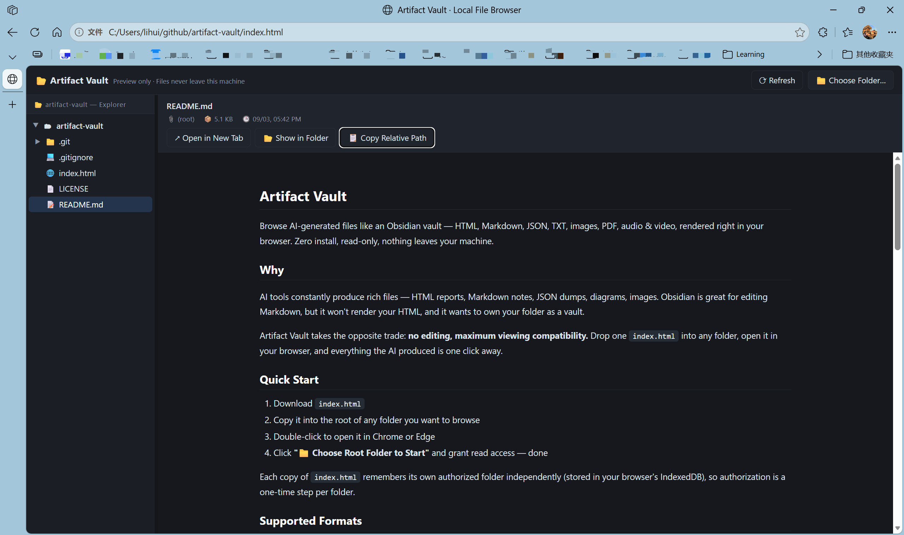

# Artifact Vault

Browse AI-generated files like an Obsidian vault — HTML, Markdown, JSON, TXT, images, PDF, audio & video, rendered right in your browser. Zero install, read-only, nothing leaves your machine.

**[🌐 Try the live demo](https://weeform.github.io/artifact-vault/)** — or [download `index.html`](./index.html) to use it anywhere.

## Why

AI tools constantly produce rich files — HTML reports, Markdown notes, JSON dumps, diagrams, images. Obsidian is great for editing Markdown, but it won't render your HTML, and it wants to own your folder as a vault.

Artifact Vault takes the opposite trade: **no editing, maximum viewing compatibility.** Drop one `index.html` into any folder, open it in your browser, and everything the AI produced is one click away.

## Quick Start

1. Download [`index.html`](./index.html)
2. Copy it into the root of any folder you want to browse
3. Double-click to open it in Chrome or Edge
4. Click **"📁 Choose Root Folder to Start"** and grant read access — done

Each copy of `index.html` remembers its own authorized folder independently (stored in your browser's IndexedDB), so authorization is a one-time step per folder.

## Supported Formats

| Category | Formats | Rendering |
|----------|---------|-----------|
| Markdown | `md` `markdown` `mdown` `mkd` | Fully rendered (marked + highlight.js) |
| HTML | `html` `htm` `xhtml` | Fully rendered, local CSS inlined, relative images resolved |
| Images | `png` `jpg` `jpeg` `gif` `webp` `svg` `avif` `bmp` `ico` | Native browser decoding |
| Documents | `pdf` | Native PDF viewer |
| Video | `mp4` `webm` `ogv` `mov` `m4v` | Native playback |
| Audio | `mp3` `wav` `ogg` `flac` `m4a` `aac` `opus` | Native playback |
| Code / Text | `json` `txt` `log` `csv` `yaml` `xml` `py` `js` `ts` `sh` … | Syntax highlighted; charset auto-detection (BOM / declared encoding / GBK heuristic) |
| Other | unknown extensions | Sniffed: shown as text, or marked as binary |

Anything Obsidian leaves as raw text or refuses to open renders here.

> **Media note:** the extension names a container — actual playback depends on the codec inside it. H.264/AAC, VP8/VP9, AV1, Opus and FLAC play natively in Chromium; HEVC and ProRes generally don't.

## Features

- **VS Code-style file tree** — lazy loading, drag-to-resize, directory state preserved on refresh
- **Zero install, zero CDN** — no server, no build, no dependencies to install; all libraries are vendored into the file, so it works fully offline and on locked-down machines where you can't install software
- **New-tab view** — open any file in a clean standalone tab (no UI chrome), ideal for full-page screenshots; relative images are inlined so the document is fully self-contained
- **Locate on disk** — jump to the file's containing folder
- **Safe by design** — previews run in sandboxed iframes with scripts disabled; read-only access only

## Privacy & Security

- **Read-only** — uses the File System Access API in `read` mode; the page cannot write, move, or delete anything
- **Local only** — no telemetry, no accounts, no upload path. Your files never leave the machine
- **Zero CDN** — marked & highlight.js are vendored inline; the app itself makes no network requests. (Previewed documents may still load external images/CSS they reference — rendered inside the sandbox.)
- **Sandboxed previews** — HTML/Markdown render inside sandboxed iframes; embedded scripts do not execute
- **Permission memory** — folder grants are stored locally in IndexedDB, one record per deployed copy

## Browser Support

| Browser | Status |
|---------|--------|
| Chrome / Edge (Chromium) | ✅ Fully supported |
| Firefox | 🚧 Planned (fallback via `webkitdirectory`) |
| Safari | 🚧 Planned (fallback via `webkitdirectory`) |

The directory-access API used today (`showDirectoryPicker`) is Chromium-only. A universal fallback is on the roadmap — see below.

## Roadmap

- [x] Vendor marked & highlight.js into the file — fully offline, zero CDN
- [ ] Firefox / Safari support via `webkitdirectory` fallback
- [ ] Obsidian vault syntax: `[[wikilinks]]`, `![[embeds]]`, callouts
- [ ] Office formats: docx / xlsx / pptx, EPUB
- [ ] Full-text search across the folder

## FAQ

**Why not just open the folder in Obsidian?**
Obsidian renders only Markdown; HTML shows as raw code or a broken embed, and JSON/images/code get no special treatment. It also asks to convert your folder into a vault. Artifact Vault is read-only and renders everything the browser can.

**Why copy `index.html` into each folder?**
No server means no install — but browser security requires the page itself to request folder access, and each deployment location keeps its own permission memory. In practice: one click, once per folder.

**Can it edit files?**
No, by design. Read-only is the safety guarantee that lets you point it at folders shared with other tools (Obsidian, editors, sync clients) without risk.

## License

Released under the [MIT License](./LICENSE).

Bundled libraries (vendored inline): [marked](https://github.com/markedjs/marked) v12.0.2 (MIT), [highlight.js](https://highlightjs.org/) v11.9.0 (BSD-3-Clause). Full license texts are embedded at the top of each vendored block in [`index.html`](./index.html).
